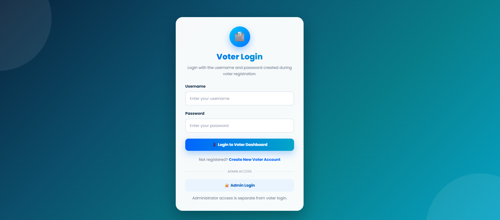
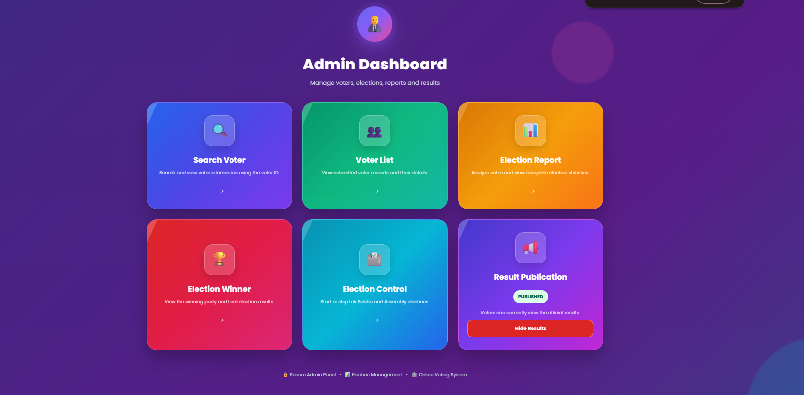

# Online Voting System

A secure web-based Online Voting System developed using Spring Boot, Thymeleaf and MySQL. The application allows registered voters to vote in Assembly and Lok Sabha elections and provides election-management features for administrators.

## Features

- Voter registration and login
- Assembly and Lok Sabha elections
- State-wise and election-wise political parties
- One vote per voter for each election
- Voter ID validation
- Election start and stop controls
- Admin login and dashboard
- Publish and hide election results
- Party-wise vote counting
- Winner declaration
- Election-result charts
- Voter search and reports
- Email notification after vote submission
- Responsive design for mobile and desktop

## Technologies Used

- Java 17
- Spring Boot 3
- Spring MVC
- Spring Data JPA
- Thymeleaf
- MySQL
- Maven
- HTML
- CSS
- JavaScript
- Chart.js

## Environment Variables

The following environment variables are required:

```text
DB_URL
DB_USERNAME
DB_PASSWORD
MAIL_USERNAME
MAIL_APP_PASSWORD
ADMIN_USERNAME
ADMIN_PASSWORD
ADMIN_EMAIL
```

Private credentials are not stored in this repository.

## Running the Application

1. Clone the repository.
2. Configure the required environment variables.
3. Start MySQL.
4. Run:

```bash
mvn spring-boot:run
```

5. Open:

```text
http://localhost:5555
```

## Screenshots

### Voting Page



### Admin Dashboard



## Author

Gujarathi ChandraSekhar